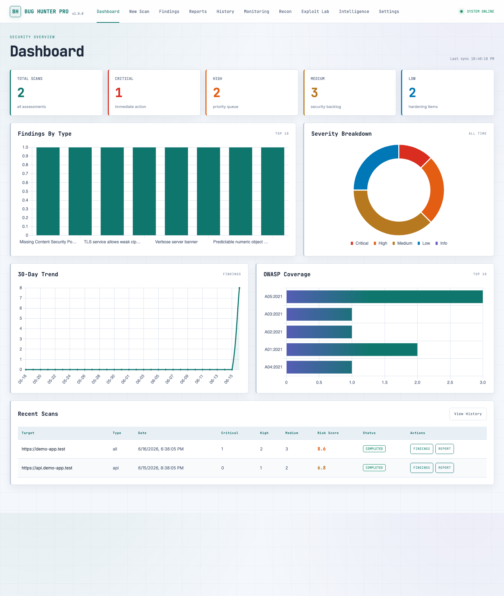
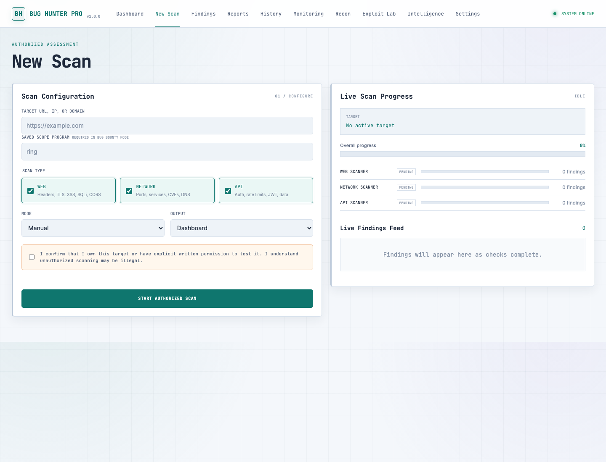

# Bug Hunter Pro


Bug Hunter Pro is an authorization-first vulnerability assessment dashboard for web, network, and API testing. It combines parallel scanners, recon helpers, live scan progress, finding triage, recurring monitoring, alerting, and PDF/HTML reporting in a local Flask application.

> Use this tool only on systems you own or have explicit written permission to test. Automated findings can be wrong, incomplete, or disruptive. Validate every result manually before acting on it or reporting it.

## Screenshots





## Features

- Web checks for headers, TLS, clickjacking, reflected XSS, SQL error signals, CORS, sensitive files, admin paths, and `robots.txt`.
- Network checks for common ports, Nmap service discovery, NVD CVE enrichment, weak SSH/TLS algorithms, DNS records, AXFR exposure, WAF signatures, and bounded default-credential probes.
- API checks for discovered endpoints, missing authentication, rate-limit behavior, predictable IDs, JWT issues, and sensitive data patterns.
- Recon modules for subdomains, JavaScript endpoint review, technology fingerprinting, Wayback URLs, and manual dork generation.
- Validation helpers for blind XSS, SQL injection, SSRF, SSTI, OAuth, XXE, password reset, session, IDOR, privilege escalation, and OOB callbacks.
- SQLite-backed scan history, false-positive tracking, scan comparison, CSV export, and report preview.
- Recurring monitoring with email and Slack alerts.
- PDF and standalone HTML reports.

## Tech Stack

| Area | Tools |
|---|---|
| App | Python, Flask, Flask-CORS |
| HTTP and parsing | Requests, Beautiful Soup |
| Network | Nmap, Paramiko, dnspython, Python SSL |
| Storage | SQLite |
| Scheduling | `schedule`, daemon threads |
| Reports | ReportLab, standalone HTML/CSS/JavaScript |
| Dashboard | Vanilla JavaScript, Chart.js, custom CSS |

## Requirements

- Python 3.9 or newer
- Nmap installed and available on `PATH`
- Network access to only the targets you are authorized to assess

Install Nmap:

```bash
# macOS
brew install nmap

# Ubuntu/Debian
sudo apt-get update && sudo apt-get install -y nmap

# Windows with Chocolatey
choco install nmap
```

## Installation

```bash
git clone https://github.com/Kousiksamanta1/Bug-Hunter-Pro.git
cd Bug-Hunter-Pro
python -m venv .venv
```

Activate the environment:

```bash
# macOS/Linux
source .venv/bin/activate

# Windows PowerShell
.venv\Scripts\Activate.ps1
```

Install dependencies:

```bash
python -m pip install --upgrade pip
python -m pip install -r requirements.txt
```

## Configuration

Create a local `.env` file from the example template:

```bash
# macOS/Linux
cp .env.example .env

# Windows PowerShell
Copy-Item .env.example .env
```

Common settings:

| Variable | Purpose |
|---|---|
| `NVD_API_KEY` | Optional NVD key for higher CVE lookup limits |
| `VIRUSTOTAL_API_KEY` | Reserved for optional reputation enrichment |
| `ALERT_EMAIL` | Email recipient for alert notifications |
| `SMTP_HOST`, `SMTP_PORT` | SMTP server settings |
| `SMTP_USER`, `SMTP_PASS` | SMTP credentials |
| `SLACK_WEBHOOK_URL` | Slack incoming webhook URL |
| `NUCLEI_PATH` | Path to the `nuclei` executable |
| `DB_PATH` | SQLite database path |
| `REPORT_OUTPUT_DIR` | PDF/HTML report output directory |

Keep `.env`, generated reports, and SQLite databases out of version control.

## Usage

Start the dashboard:

```bash
python main.py
```

Start a manual scan and open the dashboard:

```bash
python main.py --target example.com --mode manual
```

Run a full automatic scan and export reports:

```bash
python main.py --target example.com --mode auto --output all
```

Run only API checks:

```bash
python main.py --target https://api.example.com --mode auto --scan api --output html
```

Run recurring monitoring:

```bash
python main.py --target example.com --mode monitor --schedule 24h
```

The dashboard starts on port `5000` by default and falls back to the next available port when needed.

## CLI Options

| Option | Values | Default |
|---|---|---|
| `--target` | URL, IP, or domain | Empty |
| `--mode` | `manual`, `auto`, `monitor` | `manual` |
| `--output` | `dashboard`, `pdf`, `html`, `all` | `dashboard` |
| `--scan` | `web`, `network`, `api`, `all` | `all` |
| `--schedule` | `30m`, `24h`, `7d`, etc. | `24h` |
| `--port` | Dashboard TCP port | `5000` |
| `--recon` | Run recon modules before scanning | Disabled |
| `--oob` | Start local callback receiver | Disabled |
| `--nuclei` | Run Nuclei after scanning | Disabled |
| `--scope` | Saved scope program name | Empty |

## Dashboard Sections

| Section | Purpose |
|---|---|
| Dashboard | Scan totals, severity counts, charts, and recent assessments |
| New Scan | Authorized scan setup and live progress |
| Findings | Vulnerability register, filters, evidence, remediation, and CSV export |
| Reports | PDF/HTML downloads and inline previews |
| History | Timeline and scan-to-scan comparison |
| Monitoring | Recurring targets and alert history |
| Recon | Passive discovery and target intelligence |
| Exploit Lab | Authorized validation helpers with scope checks |
| Intelligence | Scope management, Nuclei runner, and duplicate research |
| Settings | API keys, alerts, scan defaults, and bug-bounty safeguards |

## Bug-Bounty Safety

Bug Hunter Pro includes optional safeguards for scoped bug-bounty work:

- Require a saved scope before scanning.
- Restrict production bounty scans to web/API checks.
- Disable network scans, broad subdomain enumeration, Nuclei, and recurring monitoring in safe mode.
- Apply researcher identification and request-rate limits.
- Block requests that leave the starting host when the safe profile requires it.

Always verify the live program policy before scanning. Scope can change at any time.

## Reports

CLI exports and dashboard downloads are written to `reports/` by default. Reports can contain sensitive target data and should be reviewed before sharing.

## Validation

Run basic checks:

```bash
python -m compileall -q .
python - <<'PY'
from main import create_app
app = create_app()
client = app.test_client()
assert client.get("/").status_code == 200
assert client.get("/api/stats").status_code == 200
print("Smoke test passed")
PY
```

## Limitations

- Nmap must be installed separately.
- Some checks send repeated requests or test payloads.
- Default-credential probes can trigger alerts or lockouts if used outside a coordinated test plan.
- Heuristic findings can be false positives.
- This project does not replace manual security testing or a formal penetration test.

## Contributing

Read [CONTRIBUTING.md](CONTRIBUTING.md) before opening a pull request. Report security issues using [SECURITY.md](SECURITY.md), not public issues.

## License

Bug Hunter Pro is released under the [MIT License](LICENSE).
